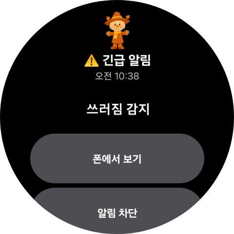
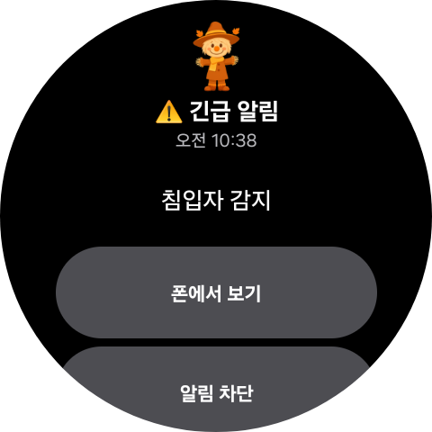

# README

#  Heoby


## AI 기반 실시간 모니터링 시스템

> **Heoby**는 AI 객체 감지 및 포즈 추정 기술을 활용한 실시간 모니터링 서비스입니다. <br>YOLO와 MediaPipe를 활용하여 실시간 영상 분석을 수행하고, MQTT 프로토콜을 통해 즉각적인 알림을 제공하여 안전하고 스마트한 모니터링 환경을 구축합니다.

- **개발 기간** : 2024.10.10 ~ 2024.11.18 (6주)
- **플랫폼** : Web, Mobile (Android)
- **개발 인원** : 6명

## 👥 팀원

| 이름          | 역할                                                 |
| ------------- | ---------------------------------------------------- |
| 이상욱        | 팀장, INFRA, AI, FASTAPI          |
| 신유빈        | 백엔드, AI 연동, 알림 시스템, FCM                    |
| 염아연        | 백엔드, 인증/인가, 대시보드 API                      |
| 강태욱        | 프론트엔드, 모바일 앱 개발, UX/UI, 웹 대시보드, 실시간 모니터링 UI                     |
| 김범주        | ML/AI, YOLO 객체 감지, MediaPipe 포즈 추정           |

---

## 🧰 기술 스택

<div align="center">
  <!-- Core -->
  
  
  
  
  
  <br/>

  <!-- DevOps / Cloud -->
  
  
  
  <br/>

  <!-- Frontend -->
  
  
  
  
  
  
  
  <br/>

  <!-- ML/AI & IoT -->
  
  
  
  
  
  
  
</div>

### 백엔드

- **언어**: Java 17
- **프레임워크**: Spring Boot 3.3.4
- **데이터베이스**: MySQL 8.0.x (InnoDB, utf8mb4)
- **ORM**: JPA (Hibernate)
- **캐싱**: Redis 7.x (세션 및 캐시 저장소로 활용)
- **실시간 통신**: MQTT (Eclipse Paho), Spring Integration MQTT
- **미디어 서버**: MediaMTX (RTSP 스트리밍)
- **서버**: Nginx (Reverse Proxy)
- **배포/CI/CD**: Docker, Jenkins
- **클라우드**: AWS S3
- **외부 서비스**: Firebase Cloud Messaging (FCM)

### 프론트엔드

- **언어**: TypeScript
- **프레임워크**: React 19, Vite 7
- **상태 관리**: Zustand, TanStack React Query (v5)
- **스타일링**: Tailwind CSS 4
- **API 연동**: Axios
- **런타임 검증**: Typia
- **알림**: Firebase (FCM)

### ML/AI

- **언어**: Python 3.10/3.11
- **프레임워크**: FastAPI, Uvicorn
- **객체 감지**: Ultralytics (YOLO v8)
- **포즈 추정**: MediaPipe
- **영상 처리**: OpenCV
- **머신러닝**: scikit-learn (SVM 분류기)

---

## **🌐** 시스템 구조도
<div align="center">

</div>

---

## 🗃 시스템 아키텍처

Heoby 프로젝트는 마이크로 서비스 아키텍처를 기반으로 백엔드, 프론트엔드, ML 추론 서버가 유기적으로 연동되는 구조입니다.

- **프론트엔드**: 사용자의 웹(React) 및 모바일(Android) 접근을 담당하며, Nginx를 통해 백엔드와 통신합니다.
- **백엔드**: Spring Boot 애플리케이션이 비즈니스 로직을 처리하며, MySQL 및 Redis와 연동하여 서비스를 제공합니다. MQTT 브로커를 통해 실시간 이벤트를 전달받습니다.
- **ML 추론 서버**: FastAPI 기반의 경량 서버로, YOLO 객체 감지 및 MediaPipe 포즈 추정을 수행하고, 분석 결과를 MQTT/HTTP를 통해 백엔드로 전송합니다.
- **미디어 스트리밍**: MediaMTX 서버가 RTSP 프로토콜을 통해 실시간 영상 스트림을 제공합니다.
- **알림 시스템**: Firebase Cloud Messaging을 통해 모바일 디바이스로 실시간 알림을 전송합니다.
- **CI/CD**: Jenkins를 활용하여 dev/prod 환경으로 안정적인 배포를 자동화합니다.

---

## 🚀 빌드 및 배포 방법

### 1. 개발 환경

| 항목              | 내용                                                   |
| ----------------- | ------------------------------------------------------ |
| Backend 디렉토리  | `BE/heoby`                                             |
| Frontend 디렉토리 | `FE/heoby_web` (웹), `FE/heoby_mobile` (모바일)        |
| ML 서버 디렉토리  | 별도 저장소 (`ml_inference`)                           |
| IDE               | IntelliJ IDEA 2023+, VSCode                            |
| JDK/JVM           | OpenJDK 17                                             |
| Gradle            | 8.10.2 (Wrapper 사용)                                  |
| Node.js           | v20.x 이상                                             |
| Python            | 3.10 ~ 3.11                                            |
| OS/배포 대상      | Ubuntu 22.04 LTS (k13e106.p.ssafy.io)                  |
| 형상관리          | GitLab                                                 |

### 2. 빌드

**Backend**

```bash
# GitLab 소스 클론
git clone [GitLab Repository URL]
cd S13P31E106/BE/heoby
# Gradle 빌드 (Wrapper 사용)
./gradlew clean build -x test
# Docker 이미지 빌드
docker build -t heoby-be:latest .
```

**Frontend**

```bash
cd ../../../FE/heoby_web
# 패키지 설치
npm install
# 빌드
npm run build
# Docker 이미지 빌드
docker build -t heoby-fe:latest .
```

**ML Inference Server**

```bash
cd ../../../ml_inference
# Python 가상환경 생성 및 활성화
python -m venv venv
source venv/bin/activate  # Windows: venv\Scripts\activate
# 패키지 설치
pip install -r requirements.txt
# FastAPI 서버 실행
uvicorn fastapi_app.main:app --host 0.0.0.0 --port 8000
```

### 3. 배포 (Docker)

**Backend**

```bash
docker run -d --name heoby-be --env-file .env -p 8081:8081 heoby-be:latest
```

**Frontend**

```bash
docker run -d --name heoby-fe -p 3000:80 heoby-fe:latest
```

**Docker Compose 사용**

```bash
cd deploy
ENV_STAGE=prod docker compose --project-name heoby-prod \
  -f docker-compose.yml -f docker-compose.prod.yml up -d
```

_환경 변수 및 프로퍼티 설정은 `config/` 디렉토리의 환경별 설정 파일을 참조해야 합니다. Jenkins Secret File을 통해 환경 변수를 주입하는 방식이 사용됩니다._

---

## 📁 디렉토리 구조

- **FE/**: Frontend 프로젝트
  - **heoby_web/**: 웹 (React) 프로젝트
    - `src/`: 소스 코드
      - `app/`: 앱 컴포넌트
      - `features/`: 기능별 모듈
      - `pages/`: 페이지 컴포넌트
      - `shared/`: 공유 유틸리티 및 컴포넌트
      - `styles/`: 스타일 파일
  - **heoby_mobile/**: 모바일 (Android) 프로젝트
- **BE/heoby/**: Backend (Spring Boot) 프로젝트
  - `src/main/java/com/heoby/`: Java 소스 코드
    - `ai/`: AI 분석 결과 처리
    - `alert/`: 알림 시스템
    - `auth/`: 인증/인가 (JWT, Spring Security)
    - `dashboard/`: 대시보드 API
    - `detection/`: 객체 감지 이벤트 처리
    - `fcm/`: Firebase Cloud Messaging
  - `src/main/resources/`: 설정 파일, application.properties 등
  - `src/test/java/`: 테스트 코드
- **deploy/**: 배포 관련 파일
  - `docker-compose.yml`: 기본 서비스 정의
  - `docker-compose.{dev, prod}.yml`: 환경별 오버라이드
  - `backend/Dockerfile`: Backend 이미지 빌드 파일
  - `frontend/Dockerfile`: Frontend 이미지 빌드 파일
- **config/**: 환경별 설정 파일 (`.gitignore`에 포함)
- `Jenkinsfile`: Jenkins CI/CD 파이프라인 스크립트

## 화면
<div align="center">

</div>

###   WEB 화면
<div align="center">

</div>

###  폰화면
<div align="center">

</div>

###  갤럭시 와치 알림
<div  style="display: flex; flex-direction: row; gap: 10px; align-items: center; justify-content: center;">
  
  
  
</div>
# ✨ 주요 기능

### 🎥 실시간 영상 스트리밍 🤖 AI 객체 감지 및 포즈 추정 🔔 실시간 알림 시스템
<div  style="display: flex; flex-direction: row; gap: 10px; align-items: center; justify-content: center;">


</div>
<br>


-  MediaMTX 서버를 통한 RTSP 기반 실시간 영상 스트리밍을 제공합니다.
웹과 모바일 앱에서 실시간으로 모니터링 영상을 확인할 수 있습니다.

- YOLO v12을 활용한 실시간 객체 감지와 MediaPipe를 활용한 포즈 추정 기능을 제공합니다.
SVM 분류기를 통해 앉기/서기/눕기 등의 자세를 분류하고 이상 행동을 탐지합니다.

- MQTT 프로토콜을 통해 이벤트를 실시간으로 수신하고, Firebase Cloud Messaging(FCM)을 통해 모바일 디바이스로 즉각적인 알림을 전송합니다.
---

### 🤖 AI 객체 감지 및 포즈 추정
YOLO v8을 활용한 실시간 객체 감지와 MediaPipe를 활용한 포즈 추정 기능을 제공합니다.
SVM 분류기를 통해 앉기/서기/눕기 등의 자세를 분류하고 이상 행동을 탐지합니다.

---


### 📊 모니터링 대시보드
<div align="center">

</div>
<br>
실시간 모니터링 현황, 이벤트 히스토리, 통계 등을 한눈에 확인할 수 있는 웹 대시보드를 제공합니다.

---

### 🔐 인증 및 보안
Spring Security와 JWT를 활용한 안전한 인증/인가 시스템을 제공합니다.
Redis 기반의 Refresh Token 관리로 세션을 효율적으로 관리합니다.

---
